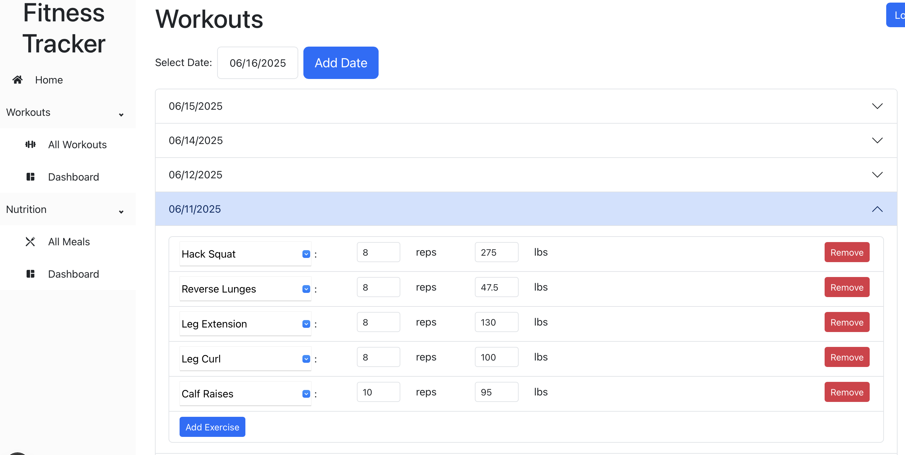
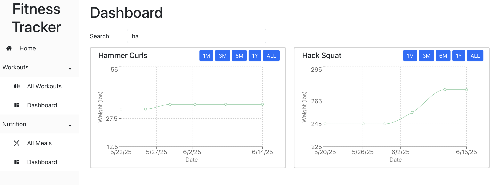
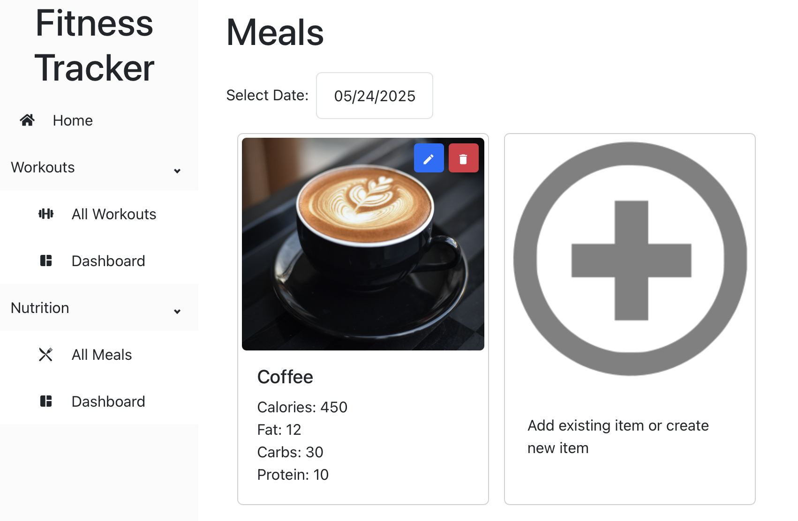
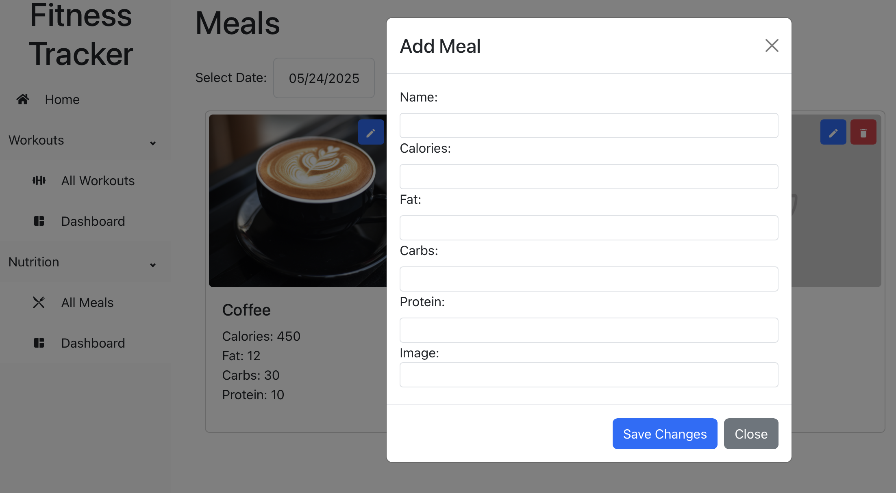
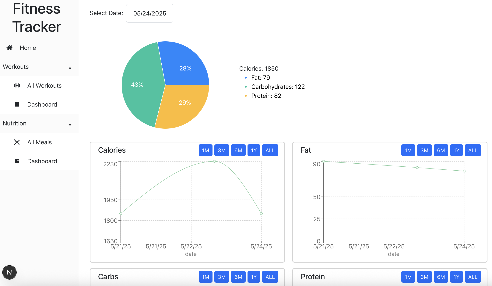

<!-- Improved compatibility of back to top link: See: https://github.com/othneildrew/Best-README-Template/pull/73 -->
<a id="readme-top"></a>
<!--
*** Thanks for checking out the Best-README-Template. If you have a suggestion
*** that would make this better, please fork the repo and create a pull request
*** or simply open an issue with the tag "enhancement".
*** Don't forget to give the project a star!
*** Thanks again! Now go create something AMAZING! :D
-->


<!-- PROJECT SHIELDS -->
<!--
*** I'm using markdown "reference style" links for readability.
*** Reference links are enclosed in brackets [ ] instead of parentheses ( ).
*** See the bottom of this document for the declaration of the reference variables
*** for contributors-url, forks-url, etc. This is an optional, concise syntax you may use.
*** https://www.markdownguide.org/basic-syntax/#reference-style-links
-->


<!-- PROJECT LOGO -->
<br />
<div align="center">
  <a href="https://github.com/AndyYao1/Fitness-App">
  </a>

<h3 align="center">Fitness Tracker</h3>

  <p align="center">
    Track your fitness journey!
    <br />
    <a href="https://github.com/AndyYao1/Fitness-App"><strong>Explore the docs »</strong></a>
    <br />
    <br />
    <a href="https://github.com/AndyYao1/Fitness-Appe/issues/new?labels=bug&template=bug-report---.md">Report Bug</a>
    &middot;
    <a href="https://github.com/AndyYao1/Fitness-App/issues/new?labels=enhancement&template=feature-request---.md">Request Feature</a>
  </p>
</div>


<!-- TABLE OF CONTENTS -->
<details>
  <summary>Table of Contents</summary>
  <ol>
    <li>
      <a href="#about-the-project">About The Project</a>
      <ul>
        <li><a href="#built-with">Built With</a></li>
      </ul>
    </li>
    <li>
      <a href="#getting-started">Getting Started</a>
      <ul>
        <li><a href="#prerequisites">Prerequisites</a></li>
        <li><a href="#installation">Installation</a></li>
      </ul>
    </li>
    <li><a href="#usage">Usage</a></li>
    <li><a href="#contributing">Contributing</a></li>
    <li><a href="#contact">Contact</a></li>
  </ol>
</details>


<!-- ABOUT THE PROJECT -->
## About The Project

This project is designed for users to easily track their lifts and workouts and view progressions and trends over time.

<p align="right">(<a href="#readme-top">back to top</a>)</p>


### Built With

* [![Next][Next.js]][Next-url]
* [![React][React.js]][React-url]

<p align="right">(<a href="#readme-top">back to top</a>)</p>


<!-- GETTING STARTED -->
## Getting Started

To get a local copy up and running follow these simple example steps.

### Prerequisites

* npm
  ```sh
  npm install npm@latest -g
  ```

* Supabase

    Set up an account with Supabase and create a new project. Create the database tables by running the following snippets in the project's SQL editor.
    ```
    create table public.workouts (
    user_id uuid not null default auth.uid (),
    date date not null,
    name text null,
    lbs numeric null,
    reps bigint null,
    workout_id uuid not null default gen_random_uuid (),
    constraint workouts_pkey primary key (user_id, date, workout_id)
    ) TABLESPACE pg_default;
    ```

    ```
    create table public.macros (
    user_id uuid not null default gen_random_uuid (),
    name text null,
    calories numeric null,
    fat numeric null,
    carbohydrates numeric null,
    protein numeric null,
    image text null,
    macro_id uuid not null default gen_random_uuid (),
    date date null,
    constraint macros_pkey primary key (user_id, macro_id)
    ) TABLESPACE pg_default;
    ```

    Then, create the following RLS policies for each table.
    ```
    create policy ""All commands for users based on user_id"
    on public.macros
    using 
    (( SELECT auth.uid() AS uid) = user_id)
    with check (
    (( SELECT auth.uid() AS uid) = user_id));
    ```

    ```
    create policy ""All commands for users based on user_id"
    on public.workouts
    using 
    (( SELECT auth.uid() AS uid) = user_id)
    with check (
    (( SELECT auth.uid() AS uid) = user_id));
    ```

### Installation

1. Clone the repo
   ```sh
   git clone https://github.com/AndyYao1/Fitness-App.git
   ```
2. Install NPM packages
   ```sh
   npm install
   ```
3. Create a top level file `.env.local` and set these variables from your Supabase project
   ```
   NEXT_PUBLIC_SUPABASE_URL=<SUBSTITUTE_SUPABASE_URL>
   NEXT_PUBLIC_SUPABASE_ANON_KEY=<SUBSTITUTE_SUPABASE_ANON_KEY>
   ```


<p align="right">(<a href="#readme-top">back to top</a>)</p>


<!-- USAGE EXAMPLES -->
## Usage

* Add, edit, and remove exercise numbers



* Easily search for and view lifting progression for exercises over the past month to all time



* Add, edit, and remove meal information


  


* View macro distribution by day and caloric/nutrition trends over time


<p align="right">(<a href="#readme-top">back to top</a>)</p>


<!-- CONTRIBUTING -->
## Contributing

Contributions are what make the open source community such an amazing place to learn, inspire, and create. Any contributions you make are **greatly appreciated**.

If you have a suggestion that would make this better, please fork the repo and create a pull request. You can also simply open an issue with the tag "enhancement".
Don't forget to give the project a star! Thanks again!

1. Fork the Project
2. Create your Feature Branch (`git checkout -b feature/AmazingFeature`)
3. Commit your Changes (`git commit -m 'Add some AmazingFeature'`)
4. Push to the Branch (`git push origin feature/AmazingFeature`)
5. Open a Pull Request

<p align="right">(<a href="#readme-top">back to top</a>)</p>


<!-- CONTACT -->
## Contact

Andy Yao - andy.yao325@gmail.com

Project Link: [https://github.com/AndyYao1/Fitness-App](https://github.com/AndyYao1/Fitness-App)


<p align="right">(<a href="#readme-top">back to top</a>)</p>


<!-- MARKDOWN LINKS & IMAGES -->
<!-- https://www.markdownguide.org/basic-syntax/#reference-style-links -->
[Next.js]: https://img.shields.io/badge/next.js-000000?style=for-the-badge&logo=nextdotjs&logoColor=white
[Next-url]: https://nextjs.org/
[React.js]: https://img.shields.io/badge/React-20232A?style=for-the-badge&logo=react&logoColor=61DAFB
[React-url]: https://reactjs.org/
[Vue.js]: https://img.shields.io/badge/Vue.js-35495E?style=for-the-badge&logo=vuedotjs&logoColor=4FC08D